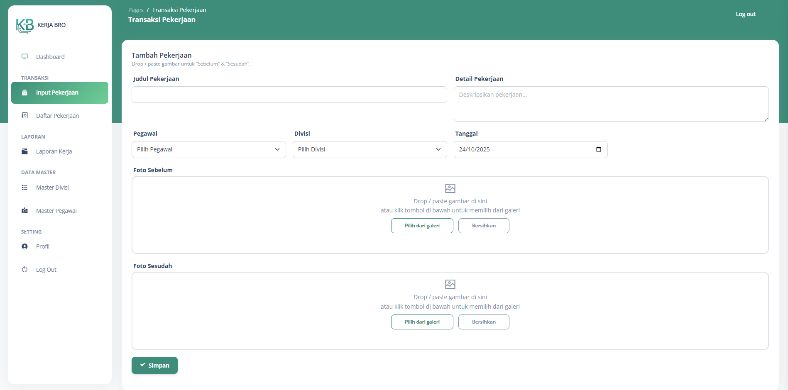
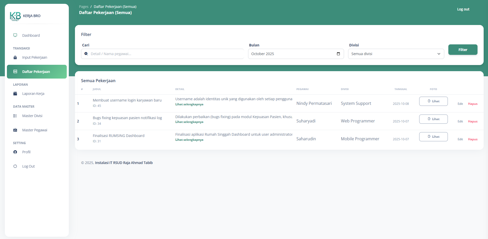
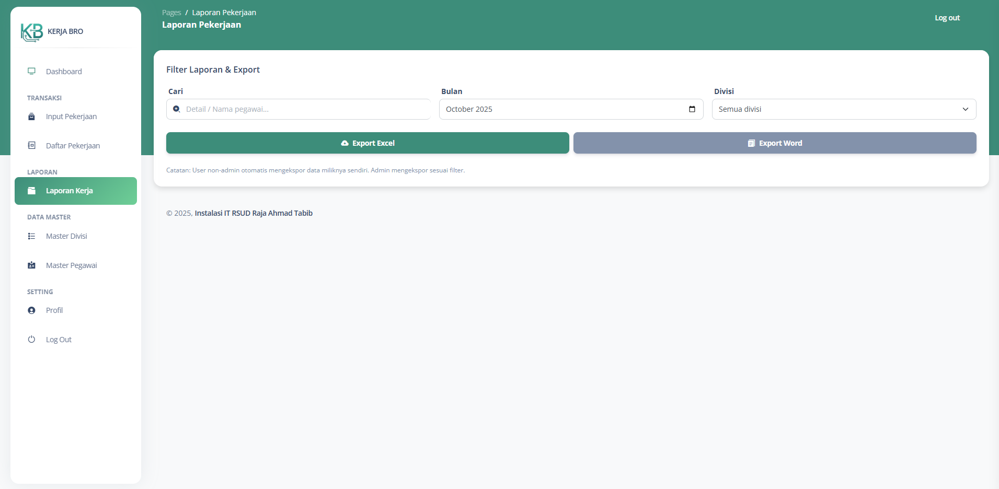

# **Kerja Bro**
> Sistem Pelaporan Pekerjaan Divisi/Instalasi IT

[](https://www.php.net/manual/en/index.php)
[](https://laravel.com)
[](https://laravel.com/docs/blade)
[](https://getbootstrap.com)
[](https://developer.mozilla.org/en-US/docs/Web/JavaScript)
[](https://developer.mozilla.org/en-US/docs/Web/HTML)
[](https://developer.mozilla.org/en-US/docs/Web/CSS)

---

## ✨ Fitur Utama
- [x] Dashboard & Laporan
- [x] Manajemen Master Data (CRUD)
- [x] Manajemen Data Pekerjaan (Input dan Daftar Pekerjaan)
- [x] Ekspor Laporan (Excel & Word)
- [x] Auto Create User (otomatis membuat akun pengguna baru)

---

## 🧰 Teknologi yang Digunakan
- **Framework:** Laravel 10.x (PHP ^8.1)
- **Templating:** Blade (Bootstrap + Soft UI)
- **Database:** MySQL 8.0+
- **Lingkungan Dev:** Laragon (Windows)
- **Frontend:** HTML5, CSS3, JavaScript (Bootstrap UI)

---

## ✅ Persyaratan Sistem
- **PHP** ≥ 8.1  
- **Composer** ≥ 2.x  
- **MySQL** ≥ 8.0  

> 💡 **Rekomendasi:** Gunakan **Laragon (Windows)** untuk pengembangan lokal yang stabil dan mudah.

---

## 🖼️ Tangkapan Layar

### Dashboard Admin


### Input Pekerjaan


### Daftar Pekerjaan


### Laporan Kerja


---

## 🚀 Instalasi

### 1️⃣ Pasang Dependensi
```bash
composer install
```

### 2) Konfigurasi
```bash
cp .env.example .env
php artisan key:generate
```
Ubah variabel di `.env` sesuai kebutuhan (lihat tabel di bawah).

### 3) Siapkan Database
```bash
php artisan migrate --seed
```

### 4) Buat Symlink Storage
```bash
php artisan storage:link
```

### 5) Jalankan Aplikasi
```bash
# Development server
php artisan serve

```


## ⚙️ Variabel Lingkungan (.env)

| Key | Contoh | Keterangan |
|---|---|---|
| `APP_NAME` | `Laravel App` | Nama aplikasi |
| `APP_ENV` | `local` | `local`, `staging`, `production` |
| `APP_KEY` | _(otomatis)_ | Kunci enkripsi |
| `APP_DEBUG` | `true` | Matikan di produksi |
| `APP_URL` | `http://localhost:8000` | URL aplikasi |
| `TIMEZONE` | `Asia/Jakarta` | Zona waktu aplikasi |
| `LOG_CHANNEL` | `stack` | Kanal log |
| `DB_CONNECTION` | `mysql` | Driver DB |
| `DB_HOST` | `127.0.0.1` | Host DB |
| `DB_PORT` | `3306` | Port DB |
| `DB_DATABASE` | `db_app` | Nama DB |
| `DB_USERNAME` | `root` | User DB |
| `DB_PASSWORD` | `` | Password DB |
| `CACHE_DRIVER` | `file` | `file`, `redis`, dll |
| `SESSION_DRIVER` | `file` | `file`, `redis` |
| `QUEUE_CONNECTION` | `database` | `sync`, `database`, `redis` |
| `FILESYSTEM_DISK` | `public` | Disk default |
| `MAIL_MAILER` | `smtp` | Mailer |
| `MAIL_HOST` | `smtp.mailtrap.io` | Host SMTP |
| `MAIL_PORT` | `2525` | Port SMTP |
| `MAIL_USERNAME` | `` | Username |
| `MAIL_PASSWORD` | `` | Password |
| `MAIL_ENCRYPTION` | `tls` | TLS/SSL |
| `MAIL_FROM_ADDRESS` | `no-reply@example.com` | Sender |
| `MAIL_FROM_NAME` | `${APP_NAME}` | Nama pengirim |

> Tambahkan variabel spesifik proyek (API key, dsb) bila diperlukan.

---
